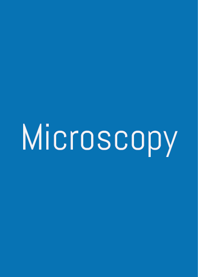
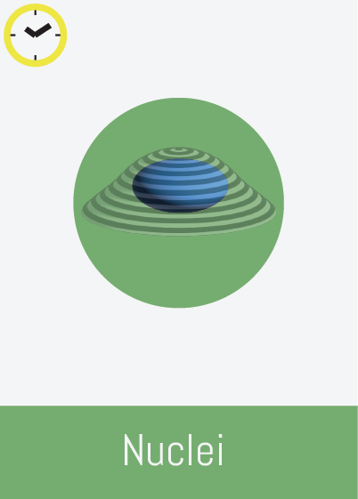

# 

A collaborative board game to teach co-localization analysis, in which the _players_ ,a.k.a **The Scientists**, team up against the _game master_ , a.k.a **Reviewer 3**.

## Game mode(s) :

You can play  in two different mode

### Science First 

_This is the recommended game mode for courses or with new gamers._

In , **The Scientists** goals(s) are to :
- fulfil all **Reviewer 3**'s demands so **The Scientists** get a valid experiment 
- try to get as few clocks () as possible at the end of the experiment

We'll just stress out one more time, the most important is to have a _pleased_ **Reviewer 3** (and only then try to limit the amount of )

### Time is of the essence 
**The Scientists** have a limited amount of  at their disposal.
**The Scientists** can only use 20  (25 or 30 for decreasing difficulty)

##  Start :

**The Scientists**  receive an experiment box, containing :
  
Cards of categories :

| Microscopy | Image |  Analysis |
| ------------- | ------------- |------------- |
| |   |  ,  , |

One of the six (so far) available experiments

| Exp | Description |  
| ------------- | ------------- |
|  | The Protein-X translocates between the cytoplasm and the nuclei. |
|  | ... |
|  | ... |
|  | ... |
|  | ... |
|  | ... |

**The Scientist** will pick up cards to define the microscopy settings they'll be using.

Available microscopy cards (  ) are : 

| Card(s) | Description | Notes |
| ------------- | ------------- | ------------- |
|  ,  ,   | The objective  | ... |
|  , , | The image modality you'll be using for your acquisition  | ... |
|  ,   | The detector | ... |
|   | Super Resolution techniques are also available, but need to be used in combination with a modality | During the **Review** step, **The Scientists**  should detail which method they used, STED, SIM, STORM ...|

**The Scientist** will pick up cards to define the image acquisitions they'll be using.

Available microscopy cards (  ) are :

{:height="200px" width="200px"}

| Card(s) | Description | Notes |
| ------------- | ------------- | ------------- |
| ... | ... | ... |
| ... | ... | ... |
| ... | ... | ... |