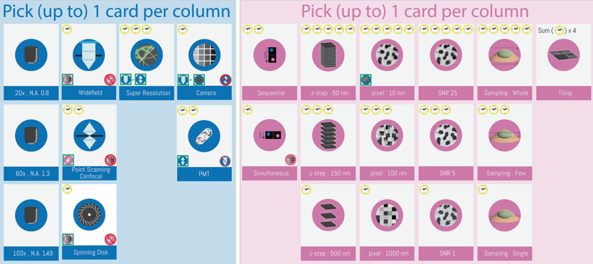
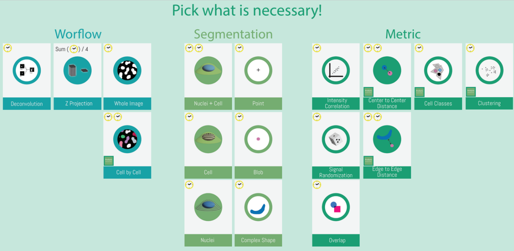
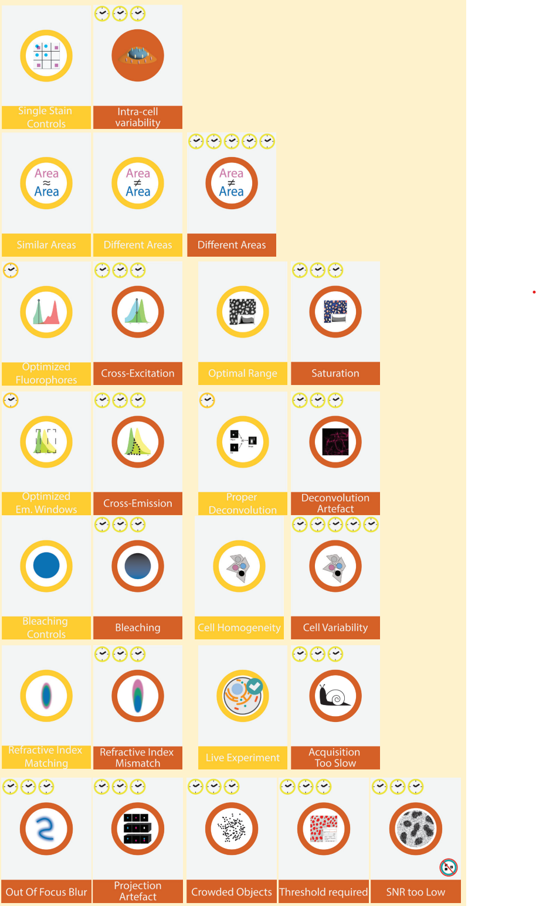

 is a collaborative board game to teach co-localization analysis, in which the players, a.k.a **The Scientists**, team up against the game master , a.k.a **Reviewer 3**.

# Game mechanics

In a  game **The Scientists** , receive an **Experiment** (among 5) and have to concert to prepare an **Experiment Plan** that will be reviewed by **Reviewer 3**. 

The Experiment Plan, is made of cards describing the microscope settings, the images settings and finally the analysis workflow. The **Reviewer 3** will then review the plan and give feedback, using is own deck of cards he will ask for more details, or suggest to change the settings. 

| **The Scientists**' deck | **The Reviewer 3**'s deck |
|---|---|
  |

More about the game meachnics can be found [here](https://github.com/BIOP/coLoc)

# Print the game

Please find below a link to download the game and print it yourself. 

<a href="https://github.com/BIOP/coLoc/raw/refs/heads/github_page/docs/resources/print_coloc_yourself.zip" target="_blank">    
    <button style="background-color:#36a5c7; color:white; padding:10px 20px; border:none; border-radius:5px; cursor:pointer;">        Download & Print    
    </button> 
</a> 

# Order the game

We offer 3 different edition of the game, each with a different price and content.
- **Standard** : the full game, with 3 decks of **The Scientists** cards, 1 deck of **Reviewer 3** cards, 6 decks of **The Experiment** cards, 1 dice and 4 boxes.
- **Light** : a more compact version, with only the essential cards (no boxes, nor dice). Ideal if you want to save on shipping!
- **Scientist** deck: If you think 3 teams of scientist are not enough you can order extra deck(s) of **The Scientists**.

<a href="https://docs.google.com/forms/d/e/1FAIpQLSc5xDxc1I8-ic5CToOcMGiSdL84i0TuSlYm4bUCrNZDklTReQ/viewform?usp=sharing" target="_blank">    
    <button style="background-color:#36a5c7; color:white; padding:10px 20px; border:none; border-radius:5px; cursor:pointer;">        Order the game    
    </button> 
</a> 

| | Standard | Light | Scientist Deck | 
|---|---|---|---|
| Price ( CHF) | 50 | 30 | 15 |
| **The Scientists** deck | 3 | 3 | 1 |
| **Reviewer 3** deck | 1 | 1 |  |
| **Experiments** deck | 5| 5 |   |
| Dice | 1 |  |  |
| Boxes| 4 |  |  |

# About us

This game was created by the [BIOP](https://biop.epfl.ch/) team at the [EPFL](https://www.epfl.ch/en/) in Lausanne, Switzerland.
The game was designed by [Romain Guiet](https://people.epfl.ch/romain.guiet?lang=en) with the help of [Olivier Burri](https://people.epfl.ch/olivier.burri) and the [BIOP team](https://search.epfl.ch/?filter=unit&q=PTBIOP).

# FAQ

- The cost covers the production of the game as we produce it on-demand , in-house at the EPFL as a teacing material.
- The shipping cost is not included and will be calculated based on your location.
- The game is available in English.

# Contact

If you have any question, please contact us via [github issues](https://github.com/BIOP/coLoc/issues).